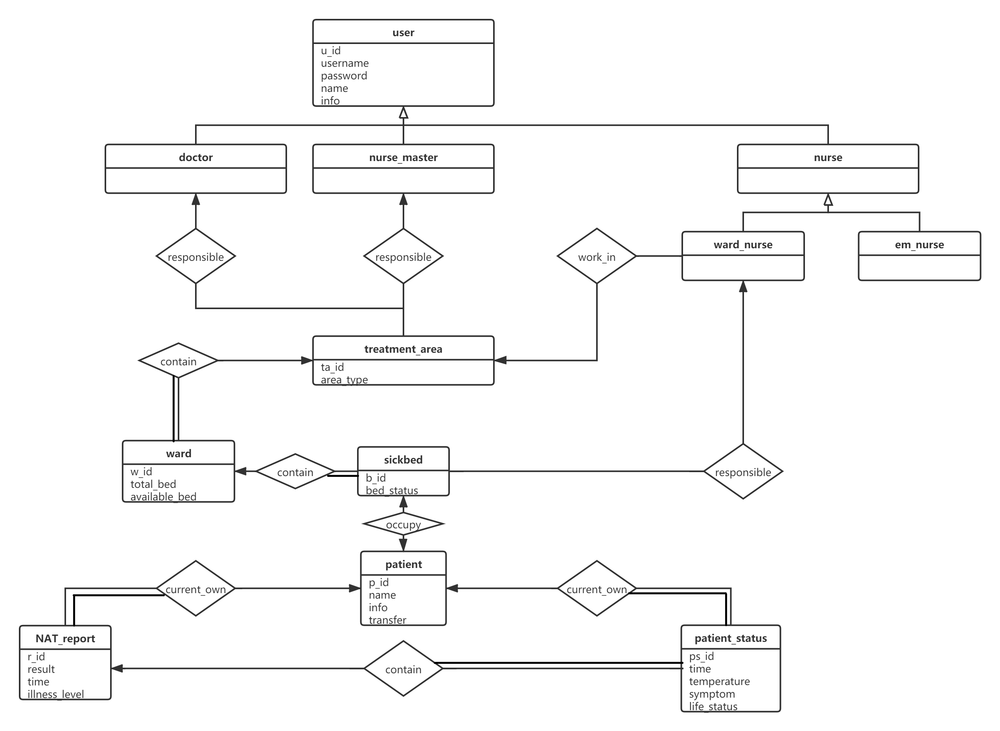

## 数据库PJ文档

> 18302010013  王中亮
>
> 18302010035  梁超毅

### ER图




### 数据库表结构说明

- user表

  - u_id：用户实体的主键，系统自增
  - username：登录用户名
  - password：登录密码
  - name：用户的姓名
  - info：用户的详细信息
  - user_type：用户类型，包括医生、护士长、病房护士、急诊护士

- treatment_area表

  - ta_id：治疗区域的主键，系统自增
  - area_type：治疗区域类型，包括轻症治疗区域、重症治疗区域、危重症治疗区域
  - area_doctor：治疗区域主治医生的主键，外键引用user表
  - area_nurse_master：治疗区域护士长的主键，外键引用user表

- ward表

  - w_id：病房的主键，系统自增
  - total_bed：病房最多容纳的病床数量
  - ward_area：病房所在的治疗区域的主键，外键引用treatmen_area表

- sickbed表

  - b_id：病床的主键，系统自增
  - bed_status：病床当前的状态，0表示空闲，1表示已占用
  - w_id：病床所在的病房的主键，外键引用ward表

- patient表

  - p_id：病人的主键，系统自增
  - name：病人的姓名
  - info：病人的详细信息
  - transfer：病人当前状态的一个属性，-1表示待出院，1表示待转移到其他区域

- nat_report表

  - r_id：核酸检测单的主键，系统自增
  - result：核酸检测的结果，取值为阴性或阳性
  - time：核酸检测的时间
  - illness_level：本次核酸检测的病人的病情等级
  - p_id：核酸检测的病人的主键，外键引用patient表

- patient_status表

  - ps_id：病人每日状态的主键，系统自增
  - time：记录这一条状态的时间
  - temperature：病人的体温
  - symptom：病人存在的症状
  - life_status：病人的生命状态，取值为康复出院、在院治疗或病亡
  - curr_report：病人最新的核酸检测单的主键，外键引用nat_report表
  - p_id：这一条状态所属的病人的主键，外键引用patient表

- ward_nurse_treatment_area表

  记录了ward_nurse和treatment_area之间的联系，一位ward_nurse最多和一个treatment_area相关联，因此将ward_nurse的主键作为联系集的主键

- sickbed_ward_nurse表

  记录了sickbed和ward_nurse之间的联系，一个sickbed最多和一个ward_nurse相关联，因此将sickbed的主键作为联系集的主键

- sickbed_patient表

  记录了sickbed和patient之间的联系，一个sickbed和一个patient之间一一对应，因此任意一方的主键都可作为该联系集的主键。此处选择了sickbed的主键作为联系集的主键

### 索引定义说明

数据库中的所有主键、外键都会自动创建索引，此处只说明自动建立的索引之外的索引

```sql
create index username_index on user (username);
create index ward_area_index on ward (ward_area);
create index patient_transfer_index on patient (transfer);
create index report_patient_index on NAT_report (p_id);
create index status_life_index on patient_status (life_status);
create index status_patient_index on patient_status (p_id);
```

- username_index

  系统使用过程中，对user的查询主要是登录时根据username查询到对应的password，因此为user表的username属性创建索引，加快根据username查询用户的效率

- ward_area_index

  为ward表的ward_area属性建立索引。ward_area指示了该ward所在的治疗区域，查询某个治疗区域中的ward时使用该索引可以加快查询效率

- patient_transfer_index

  为patient表中的transfer属性建立索引。在根据是否需要转移区域筛选病人时，使用该索引可以加快筛选查询的效率

- report_patient_index

  为nat_repoort表中的p_id属性建立索引。p_id指示了该nat_report所属的病人，查询某个病人的核酸检测单时使用该索引可以加快查询效率

- status_life_index

  为patient_status表中的life_status属性建立索引。life_status标识了病人的生命状态，在根据生命状态筛选病人时，使用该索引可以加快筛选查询的效率

- status_patient_index

  为patient_status表中的p_id属性建立索引。p_id指示了该patient_status所属的病人，查询某个病人日常状态时使用该索引可以加快查询效率


### 核心功能的SQL语句说明

- 


### 储存过程


